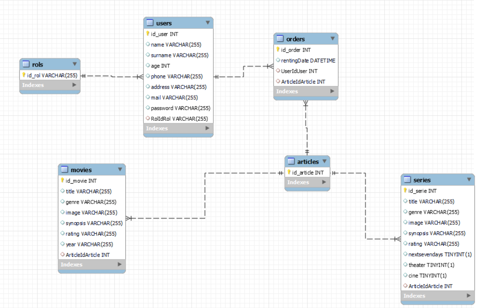

# Proyecto VideoClub API

## Proyecto realizado para GeeksHubs Academy, en el que se solicita realizar la API de un videoclub.
***
<br>
***

## Pre-requisitos del proyecto para hacerlo funcionar en tu equipo local:

* Instalar **Nodejs** en nuestro equipo, descargándolo de su página oficial
https://nodejs.org/

* Clonar el proyecto en nuestro equipo con git bash:
```
$git clone 'https://github.com/JavierMoyaSimo/project04-backendmovies.git'
```

* Instalar todas las dependecias con el siguiente comando:
```
npm i
```

* Arrancamos el servidor con el siguiente comando:
```
npm run dev
```


## Uso de la API

Botón para usar  postman,  donde están todos los endpoints para poder manipular la base de datos:
<br>

 [](https://app.getpostman.com/run-collection/11138723-eeb5cf01-1f60-493f-9755-3a67dcc8988f?action=collection%2Ffork&collection-url=entityId%3D11138723-eeb5cf01-1f60-493f-9755-3a67dcc8988f%26entityType%3Dcollection%26workspaceId%3D8cbf41ec-fd52-44cd-82e7-1a6bcbebc7d5)

## Tecnologías utilizadas en el proyecto:
Todo esto, se instalará cuando ejecutemos el comando npm i que hemos citado anteriormente:

* **express**: Instalamos express en nuestro proyecto:
```
npm install express
```
* **nodemon**: Instalamos nodemon en nuestro proyecto. También añadimos en nuestro **package.json** un script para poder ejecutarlo:
```
npm install nodemon
```
```
//AÑADIDO EN PACKAGE.JSON
"dev": "nodemon index.js"
```
```
//EJECUTAMOS EN TERMINAL
npm run dev
```
* **sequelize**: Instalamos sequelize en nuestro proyecto, haciendo que podamos conectarnos y manipular la base de datos.
```
npm install sequelize-cli -g
npm install --save sequelize mysql2 sequelize-cli
sequelize init

```
* **jsonwebtoken**: Instalamos jsonwebtoken en nuestro proyecto para gestionar uso de tokens:
```
npm install jsonwebtoken
```


## Explicación de la estructura del proyecto

Usamos el modelo vista-controlador para estructurar el proyecto. **Creamos un CRUD básico**. En el proyecto existirá la siguiente estructura:

* **index.js**: Este es el archivo principal. En este archivo se llama al archivo de las rutas, se gestiona la creación de logs, se gestiona la ruta inicial (/) y se arranca el servidor.

* **config**
    * **config.json**: En este archivo se gestiona la configuración para conectar con la base de datos. Se crea de manera automática con **sequelize**.(Paralelamente, tendremos un archivo .env, el cual meteremos en el .gitignore, con lo cual no se podrá ver desde Github).
   
* **middlewares**
    * **authMiddleware.js**: En este archivo se gestiona el Middleware de autenticacion del token.


* **db.js**: En este archivo se gestiona el acceso a la base de datos.

* **router.js**: En este archivo se gestiona las diferentes vistas que puede tener la aplicación. Se creará una ruta por cada tabla de la base de datos a la que queramos acceder.

* **views**
    * **authRoutes.js**: En este archivo gestionamos la ruta /auth y los endpoints que apuntan a dicha ruta.
    * **moviesRoutes.js**: En este archivo gestionamos la ruta /movies y los endpoints que apuntan a dicha ruta.
    * **orderRoutes.js**: En este archivo gestionamos la ruta /orders y los endpoints que apuntan a dicha ruta.
    * **seriesRoutes.js**: En este archivo gestionamos la ruta /orders y los endpoints que apuntan a dicha ruta.
    * **userRoutes.js**: En este archivo gestionamos la ruta /users y los endpoints que apuntan a dicha ruta.
    
    

* **controllers**

    * **authControllers.js**: En este archivo creamos las funciones de cada endpoint:
         * **authRegisterController**: Registra un usuario.
          * **authLoginController**: Login de un usuario
    * **moviesControllers.js**: En este archivo creamos las funciones de cada endpoint:
        * **getMovies**: Obtenemos un listado de todas las películas.
         * **getTopMovies**: Obtenemos un listado de las películas mejor puntuadas(rating : 5).
        * **getMovieById**: Obtenemos la película buscada por ID.
        * **getMovieByTitle**: Obtenemos la películas filtrada por el titulo.
        * **getMoviesByGenre**: Obtenemos un listado de las películas filtrado por el género.   
    * **orderControllers.js**: En este archivo creamos las funciones de cada endpoint:
        * **postNewOrderMovie**: Creamos un pedido de una película nuevo. 
         * **postNewOrderSerie**: Creamos un pedido de una serie nuevo. 
          * **updateOrder**: Modificamos los datos de un pedido(Modificaremos la fecha de rentig).
        * **getOrdersByUser**: Obtenemos un listado de todos los pedidos realizados por un usuario.        
        * **getAppOrders**: Lista de todos los pedidos realizados en la aplicación (securizado para que solo pueda acceder un administrador).
   
   * **seriesControllers.js**: En este archivo creamos las funciones de cada endpoint:
         * **getSeries**: Obtenemos un listado de todas las series.
         * **getTopSeries**: Obtenemos un listado de las series mejor puntuadas(rating : 5).
          * **getSerieById**: Obtenemos la serie buscada por ID.
          * **getSerieByTitle**: Obtenemos la serie filtrada por el titulo.
          * **getSeriesByGenre**: Obtenemos un listado de las series filtrado por el género. 
          * **getSeriesNextDays**: Obtenemos un listado de las series filtrado por si tendrán capítulo los próximos 7 días. 
           * **getSeriesNextTheater**: Obtenemos un listado de las series filtrado por si tendrán pase en teatros.
           * **getSeriesNextCine**: Obtenemos un listado de las series filtrado por si tendrán pase en cines.

   * **userControllers.js**: En este archivo creamos las funciones de cada endpoint:
        * **getUserByMail**: Obtenemos un usuario por mail.
        * **updateUser**: Actualizamos un usuario(sólamente podrá acceder el propio usuario)
        * **deleteUser**: Eliminamos un usuario(Opción solo para el admin)
        
* **migrations**
    * **20221101173334-create-article-table.js**: 
    * **20221101173433-create-movie-table.js**: 
    * **20221101173457-create-serie-table.js**:
    * **20221101173516-create-rol-table.js**:  
    * **20221101173554-create-user-table.js**:
    * **20221101173617-create-order-table.js**:  


* **models**
    * **article.js**: 
    * **index.js**: Gestiona la conexión con la base de datos.
    * **movie.js**: 
    * **order.js**: 
    * **rol.js**: 
    * **serie.js**: 
    * **user.js**: 
* **seeders**:
    * **01-demo-pelicula**: Se genera plantilla para la creación de registros para la tabla peliculas, tras introducir el comando:
    ```
    sequelize seed:generate --name demo-pelicula
    ```
    Añadimos registros en esta plantilla para poder agregarlos directamente a la base de datos de MySQL (300 registros).
    * **02-demo-usuario**: Se genera plantilla para la creación de registros para la tabla usuarios, tras introducir el comando:
    ```
    sequelize seed:generate --name demo-usuario
    ```
    Para agregar registros en este seeder necesitamos introducir la función de cifrado de contraseña en cada registro. Añadimos registros en esta plantilla para poder agregarlos directamente a la base de datos de MySQL (50 registros).
    * **03-demo-pedido**: Se genera plantilla para la creación de registros para la tabla pedidos, tras introducir el comando:
    ```
    sequelize seed:generate --name demo-pedido
    ```
    Añadimos registros en esta plantilla para poder agregarlos directamente a la base de datos de MySQL (3 registros).

* **.gitignore**: Archivo en el que se indica que archivos no se subirán a nuestro repositorio. Está editado de la siguiente manera:
```
/node_modules
/logs
package-lock.json
```

## Explicación de la securización de la API:
* Los usuarios que no estén logados pueden:
    * Ver todas las películas que tenemos en la base de datos.
    * Buscar películas por ID.
    * Buscar películas por título.
    * Buscar películas por genero.
    * Buscar películas por ID.
    * Acceder al login.
* Los usuarios logueados con rol 'usuario', además de poder hacer todo lo anteriormente mencionado, pueden:
    * Buscar solo su usuario por ID.
    * Actualizar solo su usuario por ID.
    * Crear un pedido para su usuario.
* Los usuarios logueados con administrador, además de poder hacer todo lo anteriormente mencionado, pueden:
    * Borrar un usuario.
    * Listar todos los pedidos de la aplicación.

